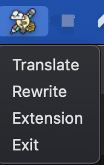

# MaliangGPT


## Project Description

MaliangGPT is a project that leverages Azure's ChatGPT to provide capabilities for translation, rewriting, and expansion of text. The main implementation is achieved through prompts. You can run the project by clicking the `maliang` script under flod `\dist`, which is compatible with both Windows and macOS.

## Features

- **Translation:** Utilize ChatGPT for text translation.
- **Rewriting:** Rewrite text using Azure's ChatGPT.
- **Expansion:** Generate more content by leveraging ChatGPT for text expansion.

## Usage

1. Clone the repository locally:

   ```bash
   git clone https://github.com/linzongzong/MaliangGPT.git
   ```

2. Navigate to the project directory:

   ```bash
   cd MaliangGPT
   ```

3. Run the `maliang` script:

   - On Windows:

     ```powershell
     .\maliang
     ```

   - On macOS:

     ```bash
     ./maliang
     ```
4. Copy the text you want to process.

5. In the taskbar, click on the corresponding functionality (e.g., translation, rewriting, or expansion).



6. The processed output will automatically be inserted at the cursor position in the copied text.

## System Requirements

- Python 3.x
- Azure account (for ChatGPT API)

## Contribution Guidelines

We welcome and appreciate contributions in any form! If you wish to contribute to the project, please refer to the [Contribution Guidelines](CONTRIBUTING.md).

## License

This project is licensed under the [MIT License](LICENSE).

```
Please save the above content as the `README.md` file in the root directory of your project. Adjust the text and links as needed based on your actual project details.